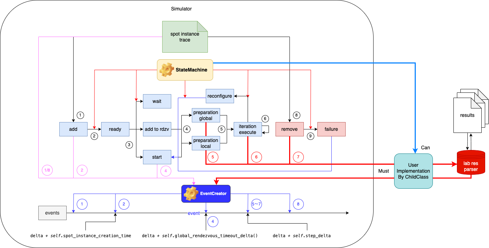

# Simulator使用说明

## Preparation

```sh
conda create -n bamboosimulate python=3.11 && conda activate bamboosimulate
pip install -r requirements-bamboosimulate.txt
```

## 实现Simulator子类

在[project_pactum/simulation/mysimulator.py](project_pactum/simulation/mysimulator.py)中需要实现`class MySimulator(Simulator)`子类

- [only used in simulator without trace]无需理睬
- [neccessary]必须实现

```py
class MySimulator(Simulator):
    def __init__(self, seed=None, start_hour=None,
                 model='GPT-2', spot_instance_trace=None, generate_addition_probabilities=False, removal_probability=None, generate_graphs=False):
        super().__init__(seed, start_hour, model, spot_instance_trace, generate_addition_probabilities, removal_probability, generate_graphs)   # 调用父类
        self.preparation_model, self.fall_back_model, self.pipeline_delta_model = res_parser_init()    # 初始化结果处理函数
    
        # Amazon EC2 Tesla T4
        if model == 'GPT-2':
            self.samples_per_step = 96  # global batch size
            self.steps_per_run = 188_828    # [only used in simulator without trace]
            self.spot_instance_desired_capacity = 48    # [only used in simulator without trace]
            self.simulate_step_delta_cache = [8100]     # related with your data calculation methods, can remove
            self.num_stages_target = 2  # data parallel stages
            self.on_demand_num_instances = 32   # 按需instance数量，取spot instance trace最大值
            self.on_demand_cost = self.on_demand_num_instances * self.on_demand_cost_per_hour   # 按需花费，无需改变
            self.on_demand_performance = self.samples_per_step / (self.simulate_step_delta_calc(self.on_demand_num_instances // self.num_stages_target) / 1000) # 根据按需每个iteration时间设置分母
            self.on_demand_value = self.on_demand_performance / self.on_demand_cost     # 按需价值，论文新定义
    

    # [neccessary] 所有节点第一次集体启动的时间（从rdzv开始放走所有节点到所有节点开始iterations运行）
    def global_preparation_delta(self):
        # return 6004.3633 * self.num_pipelines + 75630
        # 可使用if else
        return self.preparation_model.predict(sm.add_constant(np.array([0, self.num_pipelines]))).item(1)
    
    # [neccessary] 加了reconfigure的时间，reconfigure开始到进行下一个iteration运行的时间
    def local_preparation_delta(self):
        # return 6004.3633 * self.num_pipelines + 75630
        # 可使用if else
        return self.rdzv_model.predict(sm.add_constant(np.array([0, self.num_pipelines]))).item(1)
    
    # [neccessary] 当有节点失败被移除后减速比，即delta将乘此函数结果，如果模型不同，可重写原函数
    def fallback_slowdown(self):
        # return 2.4297 / (self.num_pipelines * self.num_stages) + 1
        # 可使用if else
        return self.fall_back_model.predict(np.ones(1)/np.array([self.num_pipelines * self.num_stages])).item(0) + 1

    # [neccessary] 单步执行的时间，即一个iteration运行的时间，可根据当前节点数量/pipeline数量灵活调整
    def simulate_step_delta(self):
        # 可使用if else
        self.step_delta = self.simulate_step_delta_calc(self.num_pipelines)
    
    # 示例辅助函数
    def simulate_step_delta_calc(self, num_pipelines):
        if num_pipelines > len(self.simulate_step_delta_cache):
            for i in range(len(self.simulate_step_delta_cache), num_pipelines):
                self.simulate_step_delta_cache.append(
                    # self.simulate_step_delta_cache[-1] / (0.6891 / (i + 1) + 1)
                    self.simulate_step_delta_cache[-1] / (self.pipeline_delta_model.predict((np.ones(1)/np.array([i + 1]))).item(0) + 1)
                )
        return self.simulate_step_delta_cache[num_pipelines - 1]
```

其他父类函数（比如状态转移函数）也可以自由覆盖，对于simulator各个状态的转换逻辑可按照论文设计重新编写，可在子类中自定义任意变量和辅助函数

## Simulator运行

使用实例：在项目根目录下运行：

```sh
python -m project_pactum.simulation --generate-graphs --spot-instance-trace 'traces/p3-trace.csv' --model 'GPT-2' --fig-directory 'res/simulator'
```

选项说明：

- `generate-graphs`: 生成图片，可选`generate-table`生成表格形式报告
- `spot-instance-trace`: 指示真实instance的动作数据，只包含加入和退出操作，本项目`trace`目录下已提供
- `model`: 运行模型，需要和之前实现子类中支持的模型一致
- `fig-directory`: 图片输出路径

同样可以使用项目中脚本[scripts/run-simulator.sh](scripts/run-simulator.sh)，在其中修改命令，同样在项目根目录执行：

```sh
./script/run-simulator.sh
```

## Simulator设计细节



流程如下：

TL;DR: 固定时间长度和时间点中有一系列节点加入和删除操作，这些操作对集群状态产生影响，从而影响吞吐量

1. 从`spot-instance-trace`中读取节点`add/remove`操作，令`add`操作为1，`remove`操作为8
2. `add`状态转移到`ready`状态，时间点偏移`spot_instance_creation_time`，应该是spot instance检测到启动和真正可用有一段时间差
3. `ready`状态转移到
    - `wait`，此时其他节点已经在运行
    - `add to rdzv`，此时其他节点在配置等待中
    - `start`，第一次运行
4. `start`状态转移到`global preparation`，所有节点同时启动
5. `global preparation`转移到`iteration execute`，开始执行每个iteration，每次运行结束时检查集群状态
    - 如果有新节点加入需要重新配置则由`reconfigure`状态转到`start`重新启动集群
        - 需要加入`reconfigure`和节点间传输tensor消耗的时间，令其为`local preparation`
        - `local preparation`重新转到`iteration execute`
    - 正常情况，经历`step_delta`时间后，开始下一轮iteration，状态不变

7. 根据trace信息，有可能节点突然退出，此时会出触发failure，同样转到start重新执行

