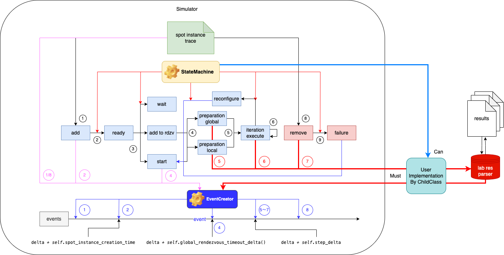

# Simulator使用说明

## Preparation

```sh
conda create -n bamboosimulate python=3.11 && conda activate bamboosimulate
pip install -r requirements-bamboosimulate.txt
```

## 实现Simulator子类

在[simulation/mysimulator.py](simulation/mysimulator.py)中需要实现`class MySimulator(Simulator)`子类

- [only used in simulator without trace]无需理睬
- [neccessary]必须实现

```py
class MySimulator(Simulator):
    def __init__(self, seed=None, start_hour=None,
                 model='GPT-2', spot_instance_trace=None, generate_addition_probabilities=False, removal_probability=None, generate_graphs=False):
    
        if model == 'GPT-3':
            # start execution when the number of arrived nodes is 8
            self.start_nodes_num = 8
            # the number of nodes that can be added at a time, bamboo do lazy reconfigure, not reconfig every time
            self.pipeline_parallel_size_target = 2
            self.global_batch_size = 1024
        
        # prepare for first time launch
        self.preparation_delta = 10000
    

    def reconfigure_delta(self):
        # reconfigure time (ms)
        return 15000
        # return 6004.3633 * self.data_parallel_size + 75630
        return self.rdzv_model.predict(sm.add_constant(np.array([0, self.data_parallel_size]))).item(1)

    def fallback_slowdown(self):
        # nodes fail and slowdown ration, seems a garbage design
        return self.pipeline_parallel_size / (self.pipeline_parallel_size - 1)

    def simulate_iteration_delta(self):
        # iteration time
        self.iteration_delta = self.simulate_iteration_delta_calc(self.data_parallel_size * self.pipeline_parallel_size)
    
    def simulate_iteration_delta_calc(self, nodes_num):
        data = {
            8: 19.1,
            10: 27.3,
            12: 17.6,
            14: 22.3,
            16: 14.7
        }
        if data.get(nodes_num) is not None:
            return data[nodes_num]
        else:
            return data[int(math.pow(2, math.ceil(math.log2(nodes_num))))]
```

其他父类函数（比如状态转移函数）也可以自由覆盖，对于simulator各个状态的转换逻辑可按照论文设计重新编写，可在子类中自定义任意变量和辅助函数

## Simulator运行

使用实例：在项目根目录下运行：

```sh
python -m simulation --generate-graphs --spot-instance-trace 'traces/p3-trace-16.csv' --model 'GPT-3' --fig-directory 'res/simulator'
```

选项说明：

- `generate-graphs`: 生成图片，可选`generate-table`生成表格形式报告
- `spot-instance-trace`: 指示真实instance的动作数据，只包含加入和退出操作，本项目`trace`目录下已提供
- `model`: 运行模型，需要和之前实现子类中支持的模型一致
- `fig-directory`: 图片输出路径

同样可以使用项目中脚本[scripts/run-simulator.sh](scripts/run-simulator.sh)，在其中修改命令，同样在项目根目录执行：

```sh
./script/run-simulator.sh
```

## Simulator设计细节



流程如下：

TL;DR: 固定时间长度和时间点中有一系列节点加入和删除操作，这些操作对集群状态产生影响，从而影响吞吐量

1. 从`spot-instance-trace`中读取节点`add/remove`操作，令`add`操作为1，`remove`操作为8
2. `add`状态转移到`ready`状态，时间点偏移`spot_instance_creation_time`，应该是spot instance检测到启动和真正可用有一段时间差
3. `ready`状态转移到
    - `wait`，此时其他节点已经在运行
    - `add to rdzv`，此时其他节点在配置等待中
    - `start`，第一次运行
4. `start`状态转移到`global preparation`，所有节点同时启动
5. `global preparation`转移到`iteration execute`，开始执行每个iteration，每次运行结束时检查集群状态
    - 如果有新节点加入需要重新配置则由`reconfigure`状态转到`start`重新启动集群
        - 需要加入`reconfigure`和节点间传输tensor消耗的时间，令其为`local preparation`
        - `local preparation`重新转到`iteration execute`
    - 正常情况，经历`step_delta`时间后，开始下一轮iteration，状态不变

7. 根据trace信息，有可能节点突然退出，此时会出触发failure，同样转到start重新执行

